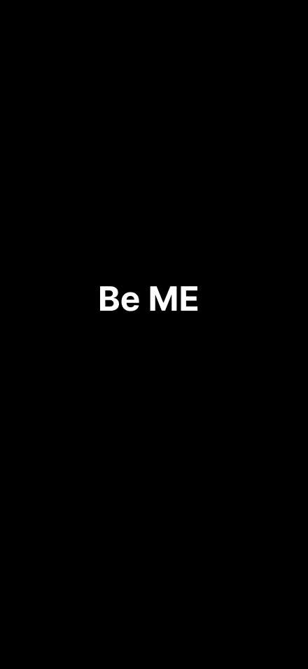
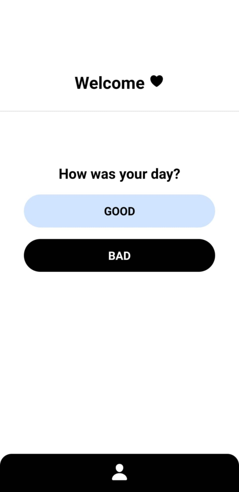
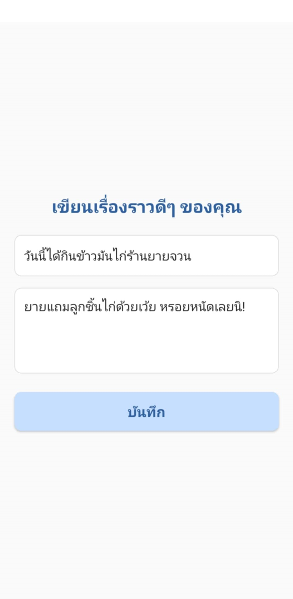
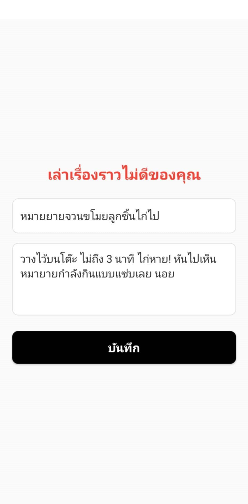
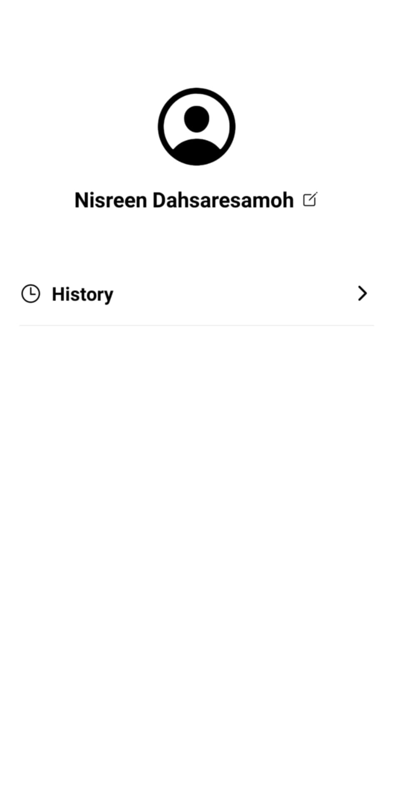
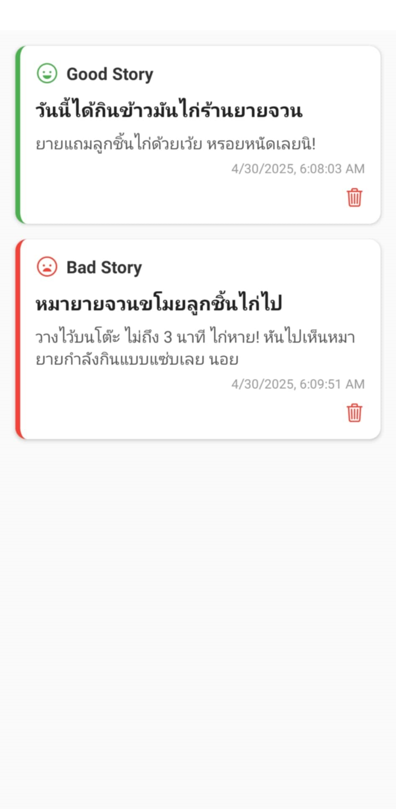

# BeMEApp
# BeMEApp

BeMEApp is a mobile app that allows users to share their stories and heal their feelings.  
It includes screens such as:
- GoodStoryScreen
- BadStoryScreen
- HistoryScreen
- ProfileScreen

## Technologies Used
- React Native
- Firebase
- GitHub
- Socket.io (for real-time features)

## Getting Started
1. Clone this repository
2. Run `npm install`
3. Run `npx expo start` to launch the app

## App Screenshots
- 
- 
- 
- 
- 
- 

## Author
Nisreen Dahsaresamoh
